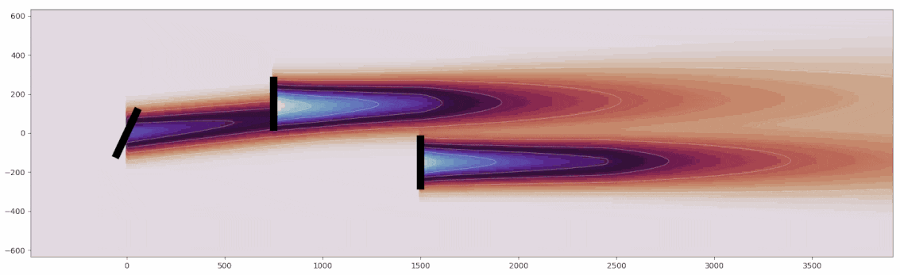

### Hi there 👋

I'm Rafael. I'm a researcher at the National Renewable Energy Laboratory ([NREL](https://www.nrel.gov))
working primarily on wind energy modeling software. In addition to wind turbine and wind farm
dynamics, I'm interested in improving the software development process especially as it relates
to research software, and I'm pursuing this throughout 2023 as a
[Better Scienfitic Software Foundation Fellow](https://bssw.io/pages/meet-our-fellows) where I'll
develop processes and training material on visually communicating elements of software design as
part of the software development process.

Please [get in touch](https://www.linkedin.com/in/rafmudaf/) to talk about wind energy and
research software!

<!--
**rafmudaf/rafmudaf** is a ✨ _special_ ✨ repository because its `README.md` (this file) appears on your GitHub profile.

Here are some ideas to get you started:

- 🔭 I’m currently working on ...
- 🌱 I’m currently learning ...
- 👯 I’m looking to collaborate on ...
- 🤔 I’m looking for help with ...
- 💬 Ask me about ...
- 📫 How to reach me: ...
- 😄 Pronouns: ...
- ⚡ Fun fact: ...
-->
